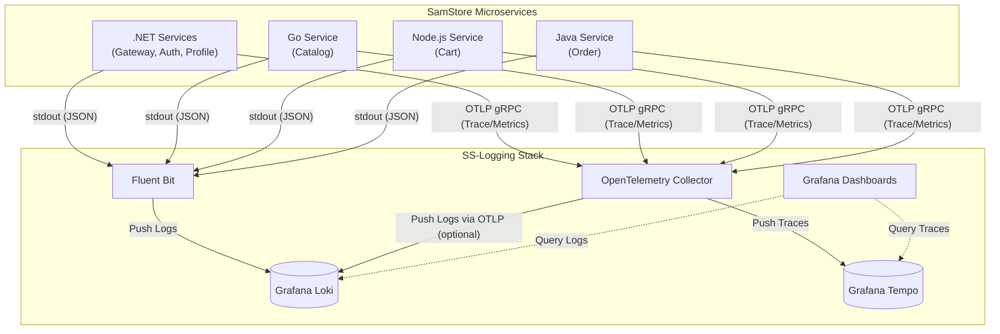

# SS-Logging

## Overview

`SS-Logging` adalah proyek infrastruktur yang menyediakan tumpukan (*stack*) Telemetri dan Observabilitas Terpusat untuk seluruh ekosistem microservices SamStore.

Menggunakan pendekatan terdepan dari **OpenTelemetry**, tumpukan ini membebaskan microservices dari keterikatan dengan vendor telemetri spesifik. Ini memfasilitasi agregasi **Logs (Log)**, **Metrics (Metrik)**, dan **Traces (Jejak Terdistribusi)** dalam satu kesatuan dashboard korelatif menggunakan **Grafana**, **Loki**, dan **Tempo**.

---

## Tech Stack

| Kategori            | Teknologi                             |
| ------------------- | ------------------------------------- |
| Data Ingestion      | OpenTelemetry Collector               |
| Log Forwarding      | Fluent Bit                            |
| Log Storage         | Grafana Loki                          |
| Trace Storage       | Grafana Tempo                         |
| Data Visualization  | Grafana                               |

---

## Arsitektur Aliran Observabilitas (Observability Pipeline)



---

## Struktur Direktori

```text
SS-Logging/
├── grafana/
│   ├── dashboards/            # Konfigurasi dashboard JSON bawaan (Pre-configured Grafana dashboards)
│   └── datasources/           # Auto-provisioning data source Loki & Tempo ke dalam Grafana
├── fluent-bit.conf            # Aturan perutean dan penangkapan input/output Fluent Bit
├── loki-config.yaml           # Parameter retensi dan indeks database log Loki
├── otel-collector-config.yaml # Pipeline penangkapan Traces/Metrics/Logs OTLP gRPC/HTTP
├── parsers.conf               # Aturan ekstraksi dan format log (docker_json)
└── tempo-config.yaml          # Aturan penyimpanan jejak Tempo
```

---

## Port dan Konfigurasi Jaringan

Untuk menghubungkan servis lokal maupun via Docker ke SS-Logging, berikut adalah port yang dibuka:

| Komponen                   | Protokol | Port    | Penggunaan Utama                             |
| -------------------------- | -------- | ------- | -------------------------------------------- |
| **OpenTelemetry Collector**| OTLP gRPC| `4317`  | Digunakan oleh SDK layanan untuk kirim Trace |
| **OpenTelemetry Collector**| OTLP HTTP| `4318`  | Alternatif kirim Trace jika gRPC diblokir    |
| **Fluent Bit**             | Forward  | `24224` | Menangkap stream console output Docker       |
| **Grafana**                | HTTP/UI  | `3001`  | Dashboard Web User Interface                 |
| **Grafana Tempo**          | HTTP     | `3200`  | Tempo HTTP API / Search Trace                |
| **Grafana Loki**           | HTTP     | `3100`  | Loki Log Search API                          |

---

## Korelasi Jejak dan Log (Trace-to-Log Correlation)

Keuntungan utama tumpukan ini adalah kemampuannya menautkan jejak API melintasi banyak microservice.
Ketika Anda melihat *Trace ID* di dasbor jejak Tempo, Grafana dapat memfilter seketika semua file Log di Loki (dari aplikasi manapun) yang terkait dengan ID tersebut.

**Syarat Implementasi di Microservice:**
Agar korelasi berfungsi, setiap Microservice **wajib** menyisipkan atribut `traceId` atau `trace_id` dalam setiap baris log JSON yang mereka cetak ke `stdout`. OpenTelemetry SDK pada setiap bahasa pemrograman umumnya sudah menyediakan pustaka integrasi (MDC/Logger hook) untuk menginjeksi traceId ini secara otomatis.

---

## Menjalankan Lingkungan Secara Lokal

Tumpukan infrastruktur ini dirancang untuk dijalankan bersamaan dengan microservices lain lewat file konfigurasi `docker-compose.yml` utama (berada di folder `SS-APIGateway`). Namun, Anda dapat menyalakannya secara independen asalkan menggunakan jaringan Docker yang sesuai.

Langkah normal (lewat direktori APIGateway):
```bash
cd SamStore/SS-APIGateway
docker-compose up -d fluent-bit loki tempo otel-collector grafana
```

Setelah aplikasi berjalan, buka browser dan navigasi ke:
**http://localhost:3001**

- **Username**: `admin`
- **Password**: `admin`

---

## Known Issues

- Dalam konfigurasi default proyek ini, penyimpanan log dan traces menggunakan path sementara (`/tmp/` dalam container) yang bersifat sekilas (*ephemeral*). Penyimpanan akan hilang apabila kontainer dihancurkan.
- Grafana Prometheus metrics belum dikonfigurasi penuh untuk visualisasi beban CPU/Memory server (walau collector disiapkan untuk menangkapnya).

## Future Improvements

- Mengganti path penyimpanan lokal sekilas menjadi Docker Persistent Volumes untuk ketahanan data.
- Menambahkan Prometheus ke dalam docker-compose dan Grafana Datasource untuk memonitor dasbor metrik infrastruktur secara real-time.
- Menerapkan AlertManager untuk membunyikan alarm ke Slack/Email jika laju kesalahan HTTP 5xx pada gateway melonjak.
